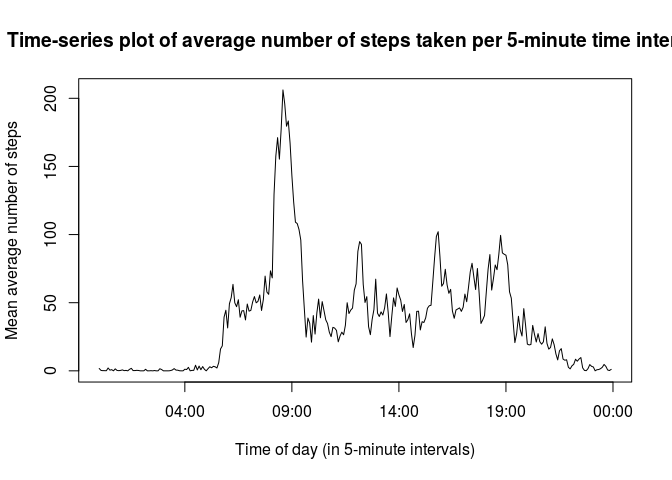
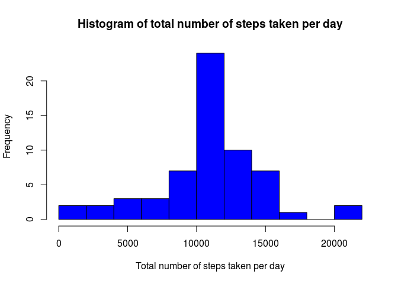

# Reproducible Research: Peer Assessment 1
Kwesi Menyah  


## Loading and preprocessing the data


```r
# load libraries to be used in this document
library(dplyr, warn.conflicts = FALSE)
library(stringr)
library(lattice)

# read in the dataset
activity <- tbl_df(read.csv("./activity.csv"))
activity
```

```
## Source: local data frame [17,568 x 3]
## 
##    steps       date interval
## 1     NA 2012-10-01        0
## 2     NA 2012-10-01        5
## 3     NA 2012-10-01       10
## 4     NA 2012-10-01       15
## 5     NA 2012-10-01       20
## 6     NA 2012-10-01       25
## 7     NA 2012-10-01       30
## 8     NA 2012-10-01       35
## 9     NA 2012-10-01       40
## 10    NA 2012-10-01       45
## ..   ...        ...      ...
```

```r
# filter out NA values
known_activity <- filter(activity, steps != "NA")
known_activity
```

```
## Source: local data frame [15,264 x 3]
## 
##    steps       date interval
## 1      0 2012-10-02        0
## 2      0 2012-10-02        5
## 3      0 2012-10-02       10
## 4      0 2012-10-02       15
## 5      0 2012-10-02       20
## 6      0 2012-10-02       25
## 7      0 2012-10-02       30
## 8      0 2012-10-02       35
## 9      0 2012-10-02       40
## 10     0 2012-10-02       45
## ..   ...        ...      ...
```


## What is the mean total number of steps taken per day?


```r
# group data according to date
per_day <- group_by(known_activity, date)

# calculate total number of steps for each date group (i.e. each day)
total_per_day <- summarise(per_day, total_steps = sum(steps))

# draw histogram of total number of steps for each day
hist(total_per_day$total_steps, col = "red", breaks = 10, main = "Histogram of total number of steps taken per day", xlab = "Total number of steps taken per day")
```

 

```r
# calculate mean total number of steps
mean_of_total <- mean(total_per_day$total_steps)
mean_of_total
```

```
## [1] 10766.19
```

```r
# calculate median total number of steps
median_of_total <- median(total_per_day$total_steps)
median_of_total
```

```
## [1] 10765
```

The mean of the total number of steps taken each day is 10766 steps to 0 decimal places.

The median of the total number of steps taken each day is 10765 steps.


## What is the average daily activity pattern?


```r
# group data according to interval
by_interval <- group_by(known_activity, interval)

# calculate mean average number of steps for each interval
mean_per_interval <- summarise(by_interval, mean_steps = mean(steps))

# convert integers representing time intervals into date objects
time_of_day <- strptime(str_pad(mean_per_interval$interval, 4, pad = "0"), "%H%M")

# plot time-series graph
plot(time_of_day, mean_per_interval$mean_steps, type = "l", main = "Time-series plot of average number of steps taken per 5-minute time interval", xlab = "Time of day (in 5-minute intervals)", ylab = "Mean average number of steps")
```

 

```r
# calculate interval for maximum number of steps
max_interval <- mean_per_interval$interval[which.max(mean_per_interval$mean_steps)]
max_interval
```

```
## [1] 835
```

```r
# convert interval for maximum number of steps to string showing the time of day using the 24-hour clock
string_max_interval <- paste0(0, substring(max_interval, 1, 1), ":", substring(max_interval, 2))
string_max_interval
```

```
## [1] "08:35"
```

The 5-minute interval with the greatest number of steps is the interval denoted by 835, which corresponds to 08:35 using 24-hour-clock notation.

## Imputing missing values

To impute the missing values, we will use the mean from the corresponding 5-minute interval.


```r
# impute missing values with interval means
full_by_interval <- group_by(activity, interval)
imputed <- ungroup(mutate(full_by_interval, steps = ifelse(is.na(steps), mean(steps, na.rm = TRUE), steps)))
imputed
```

```
## Source: local data frame [17,568 x 3]
## 
##        steps       date interval
## 1  1.7169811 2012-10-01        0
## 2  0.3396226 2012-10-01        5
## 3  0.1320755 2012-10-01       10
## 4  0.1509434 2012-10-01       15
## 5  0.0754717 2012-10-01       20
## 6  2.0943396 2012-10-01       25
## 7  0.5283019 2012-10-01       30
## 8  0.8679245 2012-10-01       35
## 9  0.0000000 2012-10-01       40
## 10 1.4716981 2012-10-01       45
## ..       ...        ...      ...
```

```r
# group data according to date
imputed_per_day <- group_by(imputed, date)

# calculate total number of steps for each date group (i.e. each day)
imputed_total_per_day <- summarise(imputed_per_day, total_steps = sum(steps))

# draw histogram of total number of steps for each day
hist(imputed_total_per_day$total_steps, col = "blue", breaks = 10, main = "Histogram of total number of steps taken per day", xlab = "Total number of steps taken per day")
```

 

```r
# calculate mean total number of steps
imputed_mean_of_total <- mean(imputed_total_per_day$total_steps)
imputed_mean_of_total
```

```
## [1] 10766.19
```

```r
# calculate median total number of steps
imputed_median_of_total <- median(imputed_total_per_day$total_steps)
imputed_median_of_total
```

```
## [1] 10766.19
```

The mean of the total number of steps taken each day for the imputed data is 1.0766189\times 10^{4} steps to 0 decimal places.

The median of the total number of steps taken each day for the imputed data is 1.0766189\times 10^{4} steps.

These values are very close to the values from the first part of the assignment. The mean is exactly the same, and the median is now a non-integer value identical to the mean. The histogram is also almost exactly the same shape as in the first part of the assignment, except that the frequency for each bar has increased.

## Are there differences in activity patterns between weekdays and weekends?

```r
# add day of the week to data
imputed <- mutate(imputed, date = as.Date(date), day = weekdays(date))

imputed <- select(imputed, steps, date, day, interval)

# replace day of the week with "weekday" or "weekend"
imputed <- mutate(imputed, day = ifelse(day == "Saturday" | day == "Sunday", "weekend", "weekday"))

# convert day to factor
imputed <- mutate(imputed, day = as.factor(day))

# group data according to interval and then day
imputed <- group_by(imputed, interval, day)

# calculate mean number of steps per interval per day (weekday or weekend)
imputed <- summarise(imputed, mean_steps = mean(steps))
imputed
```

```
## Source: local data frame [576 x 3]
## Groups: interval
## 
##    interval     day  mean_steps
## 1         0 weekday 2.251153040
## 2         0 weekend 0.214622642
## 3         5 weekday 0.445283019
## 4         5 weekend 0.042452830
## 5        10 weekday 0.173165618
## 6        10 weekend 0.016509434
## 7        15 weekday 0.197903564
## 8        15 weekend 0.018867925
## 9        20 weekday 0.098951782
## 10       20 weekend 0.009433962
## ..      ...     ...         ...
```

```r
# plot data
xyplot(mean_steps ~ interval | day, data = imputed, type = "l", layout = c(1,2), ylab = "Number of Steps")
```

 

There do seem to be differences between the weekday step profile and the weekend step profile. For example, in the morning between approximately 08:30 and 09:00 the spike is larger on a weekday than on the weekend. This could be because the subject is rushing to work, but it could also be because that is when the subject goes for their morning jog. The anonymous individual also tends to wake up earlier on weekdays; sometimes not long after 05:00. The person is also generally less active after 10:00 on a weekday than on the weekend.
